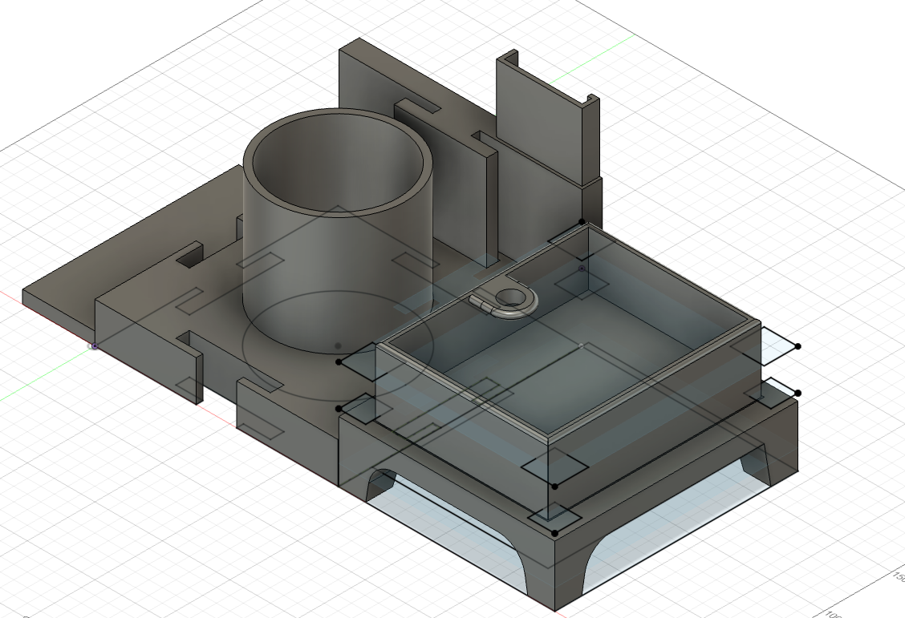
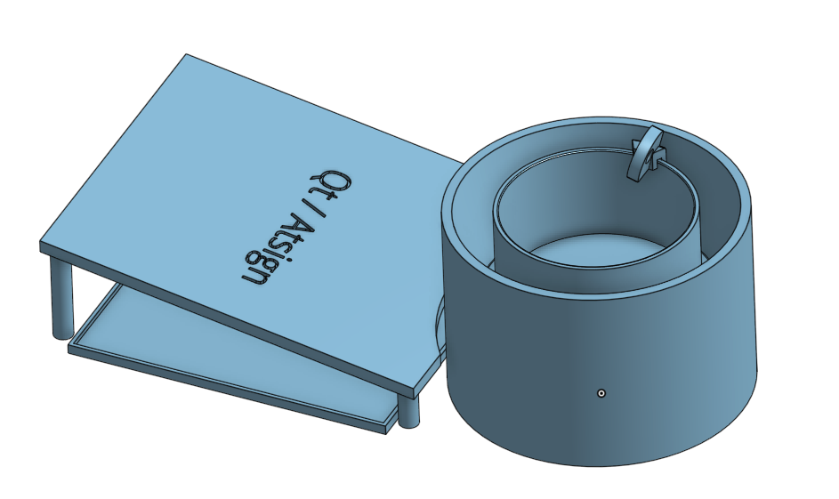

# qt_atsign_plant_demo

Qt-Atsign Plant Demo involves two components:
1. [Qt App](#qt-app)
2. [Plant](#plant)

This demo is a good demonstration of Atsign and Qt's strong integration with other systems. In this demo, each device (the app and the plant) are able to communicate with one another using Atsign's technology whilst maintaining security, privacy, and strong user experience with Qt's libraries. 

## Complete BOM

| Item | Quantity | Description | Link |
| ---- | -------- | ----------- | ---- |
| SunFounder 7 Inch HDMI 1024×600 USB IPS LCD Touchscreen Display Monitor for Raspberry Pi 400 4 3 Model B, 2 Model B, and 1 Model B+, Windows Capacitive Touch Screen | 1 | Screen for the Qt App | [Amazon](https://www.amazon.ca/gp/product/B07Y889J3X/ref=ppx_yo_dt_b_search_asin_title?ie=UTF8&th=1) |
| Raspberry Pi 4 Model B (2GB) | 1 | For the Headless Plant | |
| Raspberry Pi 4 Model B (8GB) | 1 | For the Qt App | |
| Dupont Jumper Wires (F-F, M-M, and M-F) |  | For general wiring of sensors and other electronic components | |
| Breadboard | 2 | 2.2" x 7" (5.5 cm x 17 cm) | |
| Relay Modules | 1 | Used to control the 5v DC water pump | |
| 5V DC Microsubmersible Water Pump | 1 | Used to pump water from the reservoir to the plant | [Amazon](https://www.amazon.ca/Micro-Submersible-Water-Tubing-Garden/dp/B095VSB54J/ref=sr_1_6?keywords=5v+dc+water+pump&qid=1705336213&sr=8-6) | 
| DHT11 sensor | 1 | Used to measure temperature & humidity | |
| Soil Moisture and Water Level | 1 | Used to measure soil moisture and water level | [Whadda](https://whadda.com/product/soil-moisture-sensor-water-level-sensor-module-wpse303/) |

## Physical CAD

Iteration 1 - initially, we had the water reservoir separate from the plant



Iteration 2 - in the next iteration, the water reservoir would sit directly under the plant because the 



## Qt App

The Qt App is written in python using Qt's QML. The app is designed to run on a Raspberry Pi 4 Model B (8GB) with a 7" touchscreen.

The app is running on a raspberry pi connected to a 7" touch screen which is used to interface with the plant. This is a good demonstration of remotely controlling another device securely and privately using Atsign's technology. 

## Plant

The Plant is headless (no screen) and is designed to run on a Raspberry Pi 4 Model B (2GB). The plant is connected to the Qt App via Atsign technology.

The plant is running 4 sensors (digital temperature and humidity, soil moisture, and water level) and 1 relay module connected to a 5v DC microsubmersible water pump (to pump water from the reservoir to the plant).

## Data Model

The data models we used for communication between the Plant and Qt App. (REVISED NOV 19 2023)

### Plant → Qt App

To update the Qt App on its sensor values, two things need to occur.

1. Creates 1 AtKey (@qtapp:31291.qtdemodata@plant)

Example:
```json
@qtapp:31291.datapoints.qtplant@plant
{
    “timestamp”: 31291
    “type”: “sensorData”
    “data”: {
        “temperature”: 21,
        “humidity”: 51,
        “waterLevel”: 20,
        “soilMoisture”: 34,
        “waterFlow”: 1,
        “light”: 50
    }
}
```

2. Updates 1 AtKey (@qtapp:YYYY-MM-DD.qtdemo@plant)

Example:
```json
@qtapp:2023-11-20.days.qtplant@plant
“[31291, 12345, 5678]”
```


### Qt App → Plant

To tell the plant to run the water pump, one notification is sent:

1. (pump for a certain amount of seconds)

Example:

```json

@plant:pump.qtplant@qtapp

{
    “timestamp”: 3129319391
    “type”: “pumpWithSeconds”
    “data”: {
        “seconds”: 3
    }
}
```

