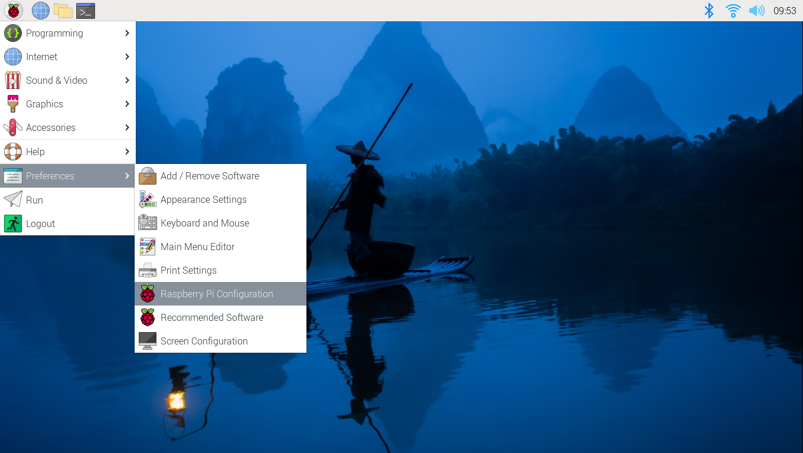
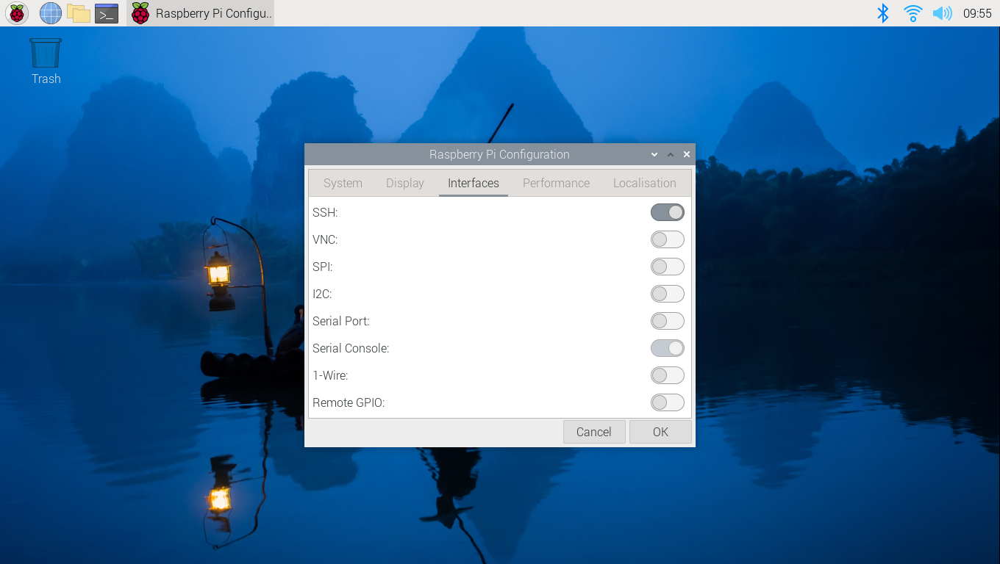
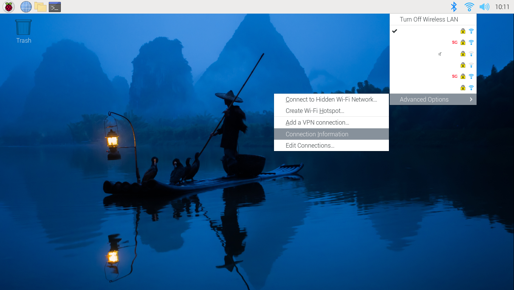

# SSHNP with a Raspberry Pi Demo

The demonstration features the utilization of a Raspberry Pi 3 Model B. This documentation guides you through the process of setting up a Raspberry Pi from scratch, encompassing the following steps:

### What you will need
- Raspberry Pi 4 Model B
- MicroSD card (8GB or more preferably)
- MicroSD card reader
- Power supply (5V, 2.5A)
- Ethernet cable (optional)
- HDMI to microHDMI cable 

### 1. Downloading the latest version of Raspbian OS 
You can download the latest version of Raspberry Pi OS (previously called Raspbian) from the official website [here](https://www.raspberrypi.org/downloads/raspbian/). Follow the instructions on the website to install the OS on a microSD card.

### 2. Setting up the Raspberry Pi
After installing the OS on the microSD card, insert it into the Raspberry Pi. Connect the Pi to a monitor using an HDMI to microHDMI cable and plug in the power supply.

Boot up the Raspberry Pi, and follow the on-screen instructions to set it up. This involves selecting your country, language, and keyboard layout. Connect to the internet via Ethernet or WiFi and create a sudo user with a username and password if prompted.

Software updates may be required, which will take a few minutes. After the update, reboot the Raspberry Pi when prompted.

### 3. Setting up SSH
SSH is disabled by default on the Raspberry Pi. To enable SSH,you can do this two ways:
#### Using the GUI: 
Menu > Preferences > Raspberry Pi Configuration > Interfaces > Enable SSH




#### Using the command line:
Enter the following command:
```
sudo raspi-config
```
Select Interfacing Options > SSH > Yes


#### Using command line rather than Desktop OS
If you are using the command line rather than the Desktop OS, you can follow the instructions [here](https://www.raspberrypi.com/documentation/computers/remote-access.html#boot-output).

### 3. Installing sshnp
Once you have set up the Raspberry Pi, you can install sshnp by following the instructions [here](https://www.noports.com). Once you have purchased a license (or have obtained a free trial), you can follow the installation instructions [here](https://www.noports.com/sshnoports-installation).

*note* If you already have the keys to your atSigns and the atSigns are activated, proceed with the instructions below (same steps as 3.5 on [noports.com/installation](https://www.noports.com/sshnoports-installation)):
#### What you will need for this step
- atKeys files (on your client machine)
- IP address of your device
- username of your device
- The home directory of your device

How to get the IP address of your device:
```bash
hostname -I
```
or click on the network icon on the top right corner of the screen and select "Connection Information"


#### On your device
The device home directory is typically '/home/<username>'. Double check by running the following command:
```bash
echo $HOME
```

```bash
mkdir -p <device home directory>/.atsign/keys
```

#### On your client machine
```bash
scp ~/.atsign/keys/<device address>_key.atKeys <user>@<host>:<device home directory>/.atsign/keys/<device address>_key.atKeys
```


### 4. Running the demo
You can connect to your device from any machine with the following commands:
```
killall -u "$(whoami)" -r "sshnpd$"
$(sshnp@<device address> -d <device name>)
```

**Example**
```
$(sshnp@alice_device -d raspberry_pi)
```

### Updating your installation
Updating your installation
#### Device
To update the device, run the following command:

```
bash -c "$(curl -fsSL https://getsshnpd.noports.com)" -- --update
```

This will update all services installed under the current user.

#### Client
To update the client, run the following command:

```
bash -c "$(curl -fsSL https://getsshnp.noports.com)" -- --update
```

This will update the sshnp client for the current user.


